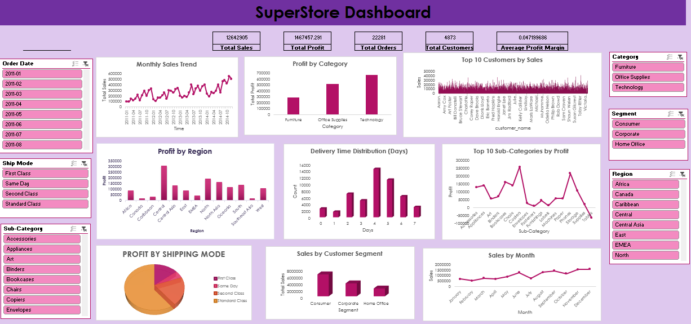

# 📊 Global Superstore EDA & Dashboard


---

## 🌐 Project Overview

This project performs **exploratory data analysis (EDA)** on the Global Superstore dataset to uncover **sales trends, profitability drivers, customer behavior, and operational insights**. The goal is to transform raw transactional data into **actionable business recommendations**.

---

## 📁 Dataset

The dataset was sourced from Kaggle:  
👉 [Global Superstore Dataset](https://www.kaggle.com/datasets/fatihilhan/global-superstore-dataset)

**Dataset Highlights:**

- 51,000+ transaction records across multiple countries and regions
- Covers product categories, customer segments, sales, profit, discounts, shipping modes, and order priorities
- Cleaned and preprocessed locally for analysis

---

## 🎯 Objectives

- Analyze **sales and profit trends** over time
- Identify **top-performing and loss-making products/categories**
- Evaluate **customer segments and regional performance**
- Provide **data-driven business recommendations**

---

## 🛠 Tools & Technologies

- **Python:** Pandas, NumPy for data cleaning and analysis
- **Matplotlib / Seaborn:** Visualization of trends
- **SQL (MySQL):** KPI calculations and aggregations
- **Excel:** Interactive dashboard with slicers, KPI cards, and charts

---

## 🔍 Key Steps

1. **Data Cleaning & Preprocessing**
   - Standardized date formats
   - Created derived features: Year, Month, Week Number, Delivery Days, Profit Margin, Discount Flag
   - Engineered helper columns for unique orders and customers

2. **Exploratory Data Analysis (EDA)**
   - Sales and profit trends over time
   - Performance by **category, sub-category, and region**
   - Customer segmentation and discount impact analysis

3. **Dashboard Development**
   - KPI cards: Total Sales, Total Profit, Profit Margin, Orders, Customers, AOV
   - Trend charts: Monthly sales and profit
   - Interactive **slicers**: Year, Market, Region, Segment, Category, Shipping Mode

---

## 📈 Dashboard Preview

<!-- Replace the placeholder with your dashboard image -->


---

## 📊 Key Insights

- Sales growth does **not always correlate** with profit growth
- High discount levels significantly reduce profit margins
- **Furniture category** underperforms in profitability
- **Same Day shipping** reduces margins due to higher costs
- A small set of customers contributes disproportionately to overall revenue

---

## 💡 Business Recommendations

- Optimize **discount strategies** to protect margins
- Re-evaluate **consistently loss-making sub-categories**
- Focus marketing on **high-value customer segments**
- Optimize **shipping modes** to reduce operational costs
- Apply **region-specific pricing and promotional strategies**

---

## 📂 Repository Structure

```

global-superstore-data-analytics/
│
├─ assets/
│ └─ dashboard_overview.png
│
├─ data/
│ └─ superstore_cleaned.csv
│
├─ sql/
│ └─ KPI_queries.sql
│
├─ excel_dashboard/
│ └─ superstore_dashboard.xlsx
│
└─ README.md

```

---

## 📌 Output

- Cleaned dataset: `data/superstore_cleaned.csv`  
- Interactive Excel dashboard: `excel_dashboard/superstore_dashboard.xlsx`  
- SQL queries for KPIs: `sql/KPI_queries.sql`

---

> This project demonstrates **end-to-end data analytics skills**: from **data cleaning and EDA** to **dashboard visualization** and **actionable business insights**.